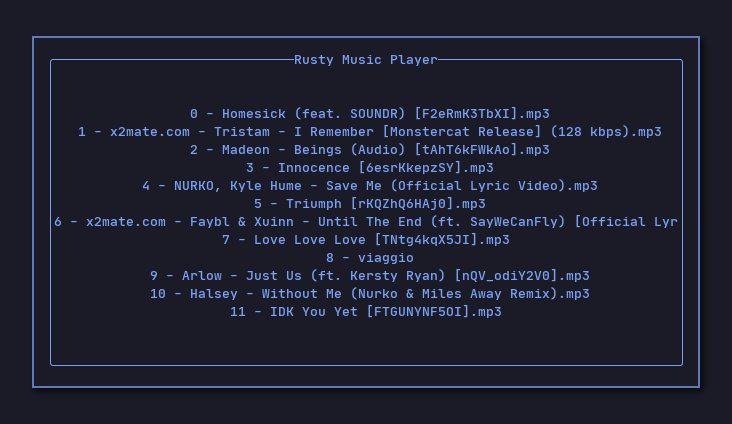

# rust-music-player 

A simple cli music player written in rust and ratatui

For now, you have to change the path in src/app.rs 

### Keys

- `up_arrow` scroll up_arrow

- `down_arrow` scroll_down

- `space` start / stop

- `0-9` play the song at index

- `+` raise volume

- `-` lower volume

- `q` or `esc` to quit

### Features

- [x] Scroll through a list of files in a directory
- [x] Play and Pause
- [x] Volume Control
- [ ] Move between folders
